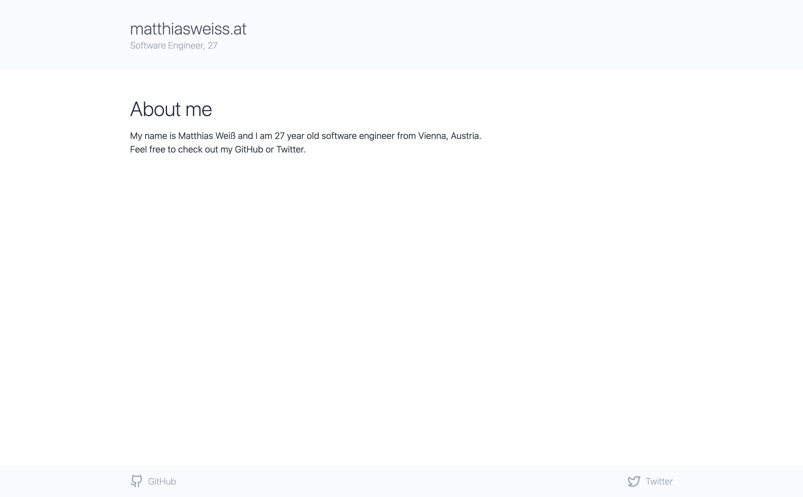
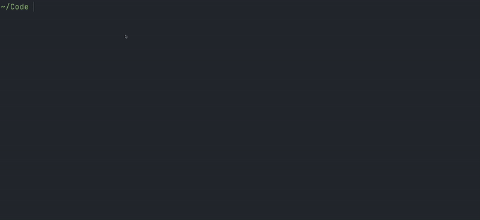
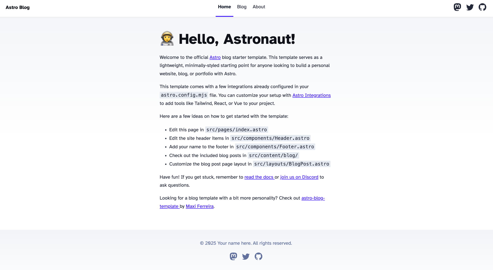

In early 2025, I decided to revamp my personal website. Yes, the one you are looking at right now!
Before, the design and content were extremely sparse, as you can see in the screenshot below
(sorry to everyone using dark mode).



After a little bit of brainstorming, I came up with two requirements for the updated site:

- **Static Site Generation (SSG)**: Since the website is deployed via GitHub Actions to GitHub Pages (which is awesome for static pages),
  I need to be able to generate a static version of the website.
- **Markdown Content**: I've enjoyed writing in Markdown for years now, and I think it's well suited for writing blog articles.

Since I've heard and read a lot of nice things about Astro, and it seemed like a perfect fit for my requirements, I chose it as the framework of choice.



I was really impressed by the DX of setting up a new Astro project. The installation wizard is awesome in itself,
but after creating the project with the "use blog template" flag, I was basically set up with a working blog.



This was a very good starting point. However, I wanted a much simpler look. While I could've gone with an existing blog theme,
e.g. [AstroPaper](https://github.com/satnaing/astro-paper?tab=readme-ov-file), I decided that I want to do the design from scratch.
I removed pretty much all the code, apart from the actual pages and the bits that were doing the Markdown parsing.
While searching for inspiration, I stumbled across [Lee Robinson's blog](https://archive.leerob.io/blog). I really liked the
minimalistic, yet refined look. When inspecting his blog, I noticed a lot of `prose` classes, which I had never seen before,
despite using Tailwind a lot over the last few years.
After some brief research, I found out about the [Tailwind Typography Plugin](https://github.com/tailwindlabs/tailwindcss-typography),
which adds some default styles to vanilla HTML, a perfect fit for styling my posts written in Markdown.

Since I mainly want to write about web development, having good-looking code blocks was important to me.
Astro uses the popular [Shiki syntax highlighter](https://shiki.style/), so tons of predefined themes can be used.
It's also possible to change the theme based on whether the user uses dark or light mode, with just a few lines of code.
You can check out the [Astro docs](https://docs.astro.build/en/guides/syntax-highlighting/#setting-light-and-dark-mode-themes) for more information.

Of course, I chose my favorite theme, OneDark (and its light mode equivalent). To showcase this, I've added a code snippet:

```ts
export default defineConfig({
  ...
  markdown: {
    shikiConfig: {
      themes: {
        dark: "one-dark-pro",
        light: "one-light",
      },
    },
  },
});
```

I also added some quality of life improvements, such as Prettier, but I won't go into detail on those.
If you are interested in any details, the source code is available on [GitHub](https://github.com/matthiasweiss/matthiasweiss.at).
