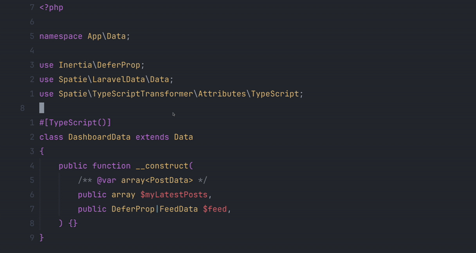

My go-to stack for building web applications is Laravel, Inertia and React. Since I have a solid TypeScript
background, I'm always trying to improve the type safety and robustness of my projects. Type safety
helps catch errors early and can even prevent them completely. However, achieving type safety (at least to the extent
it is possible with PHP and TypeScript) in Laravel & Inertia is not straightforward. You could define the types yourself,
but that is quite cumbersome and error prone. I've landed on a setup that automatically generates TypeScript types
from Laravel data objects and automatically detects any type errors immediately.

The GIF below shows an example where a property is renamed in a data class, which immediately causes an error
in the PHP code, due to the use of named arguments, as well as the TypeScript code, due to the type mismatch.



So how does this work? The main work is done by two packages:

- [Laravel Data](https://github.com/spatie/laravel-data) allows creating rich data objects, which for me replace both form requests and resources.
- [TypeScript Transformer](https://github.com/spatie/laravel-typescript-transformer) transforms these rich data objects into TypeScript types.

Both packages are installed through composer. Generating the type definitions in the current state would fail. This is due to the
`SpatieEnumTransformer`, which requires the `Spatie\Enum\Enum` class from the [Enum](https://github.com/spatie/enum) package.
Since PHP has introduced native Enums in version 8.1, this package is considered obsolete.
To fix the issue, I publish the config file of the TypeScript Transformer package, which allows me to
remove the `SpatieEnumTransformer` transformer from the `transformers` array.

```sh
composer require spatie/laravel-data spatie/laravel-typescript-transformer
php artisan vendor:publish --provider="Spatie\LaravelTypeScriptTransformer\TypeScriptTransformerServiceProvider"
```

**Update on November 21, 2025**

In my most recent project I also replaced the default `TypeDefinitionWriter`, which groups the types according to the structure of their PHP namespaces,
with the `ModuleWriter`, which lists all types individually without their namespace. This results in the following changes:

```ts
// Before: TypeDefinitionWriter (default writer)
declare namespace App.Data {
  export type DashboardData = {
    myLatestPosts: Array<App.Data.PostData>;
    feed: null | App.Data.FeedData;
  };

  // other type definitions within the namespace ...
}

// After: ModuleWriter
export type DashboardData = {
  myLatestPosts: Array<PostData>;
  feed: null | FeedData;
};
```

I then create a data class for each Inertia view, so each `inertia()` (or `Inertia::render()`) receives a complete data object.
The example shown in the GIF is a screen for a dashboard displaying the latest posts of a user and a feed containing the
latest posts of people the follow. I will use this example throughout this post.

```php
<?php

namespace App\Data;

use Inertia\DeferProp;
use Spatie\LaravelData\Data;
use Spatie\TypeScriptTransformer\Attributes\TypeScript;

#[TypeScript]
class DashboardData extends Data
{
    public function __construct(
        /** @var array<PostData> */
        public array $myLatestPosts,
        public DeferProp|FeedData $feed,
    ) {}
}
```

Within my controller I pass an instance of this data class with the given properties to the Inertia view.

```php
<?php

namespace App\Http\Controllers;

use App\Data\DashboardData;
use App\Queries\FeedQuery;
use App\Queries\LatestPostsQuery;
use Inertia\Inertia;
use Inertia\Response;

class DashboardController extends Controller
{
    public function __invoke(LatestPostsQuery $latestPostsQuery, FeedQuery $feedQuery): Response
    {
        $data = new DashboardData(
            myLatestPosts: $latestPostsQuery->get(),
            feed: Inertia::defer(fn () => $feedQuery->get()),
        );

        return inertia('dashboard/dashboard', $data);
    }
}
```

Using [deferred props](https://inertiajs.com/deferred-props) is not supported out of the box with these packages. The way
I made it work is by adding a default type replacement for the `Inertia\DeferProp` in the `config/typescript-transformer.php`
file, which was published earlier, and type hinting deferred props as `DeferProp|FeedData` in the data class. This way the
generated type is `null|FeedData`. This matches the behavior of deferred props, since the value of the deferred prop is `null` until
the closure returns a value.

```php
'default_type_replacements' => [
    ...
    Inertia\DeferProp::class => 'null',
],
```

Once the data class is ready, the `php artisan typescript:transform` can be used to generate type definitions from your data classes.
Since I prefer writing the types to a different path, I usually add a custom script to my `composer.json` file.

```php
...
"scripts": {
    ...
    "transform-types": [
        "@php artisan typescript:transform --output js/types/generated.d.ts"
    ]
},
```

This allows me to run `composer run transform-types`, without the need to add the `--output js/types/generated.ts` flag
every time. The next step is actually using the generated types in our React components. I usually extend the `SharedData` type
provided by the Laravel starter kit.

```tsx
import { SharedData } from '@/types';
import { DashboardData } from '@/types/generated';

type DashboardProps = SharedData & DashboardData;

export default function Dashboard(props: DashboardProps) {
    ...
}
```

The `SharedData` type contains everything included in the return value of the `share` method in Inertia's
`HandleInertiaRequests` middleware. Since this usually includes the authenticated user, we should also
create a data object for the user model and use it within here. This might be as simple as the example below.

```php
<?php

namespace App\Data;

use Spatie\LaravelData\Data;
use Spatie\TypeScriptTransformer\Attributes\TypeScript;

#[TypeScript]
class UserData extends Data
{
    public function __construct(
        public int $id,
        public string $email,
        public string $name,
    ) {}
}
```

Using the data object within the middleware is straightforward. We need to check whether the user is authenticated,
otherwise we pass null to the constructor of the data object, which would result in an exception.

```php
<?php

namespace App\Http\Middleware;

use App\Data\UserData;
use Illuminate\Http\Request;
use Inertia\Middleware;

class HandleInertiaRequests extends Middleware
{
    ...

    public function share(Request $request): array
    {
        $user = $request->user()
            ? UserData::from($request->user())
            : null;

        return [
            ...parent::share($request),
            'auth' => [
                'user' => $user,
            ],
        ];
    }
}
```

At this point the workflow already works. However, types have to be generated manually every time a data class is changed.
To automate this process, I add a custom vite plugin. This ensures that the generated types are always up to date during
development. I've thought of creating an npm package for this, but for now I just copy it over for each new project.
The plugin watches the `app/Data` directory for changes and runs the composer script whenever a change is detected.

```ts
import tailwindcss from "@tailwindcss/vite";
import react from "@vitejs/plugin-react";
import { exec } from "child_process";
import fs from "fs";
import laravel from "laravel-vite-plugin";
import { defineConfig } from "vite";

export default defineConfig({
  ...
  plugins: [
    ...
    {
      name: "generate-typescript-definitions",
      configureServer() {
        const path = "app/Data";

        fs.watch(path, { recursive: true }, (event, filename) => {
          console.log(`File changed: ${filename}, running artisan command...`);
          exec("composer run transform-types", (err, stdout, stderr) => {
            if (err) {
              console.error(`Error running artisan command: ${stderr}`);
            } else {
              console.log("Generated TS definitions successfully!");
            }
          });
        });
      },
    },
  ],
});
```

**Update on March 18, 2025**

I was looking into extracting an npm package for the vite plugin, but I found
[`vite-plugin-watch`](https://www.npmjs.com/package/vite-plugin-watch), which basically does the same thing
as my vite plugin and, from the looks of it, the creator had the exact same use case as me. Using the plugin is straightforward,
which means I'll probably use it from here on out.

```ts
import { watch } from 'vite-plugin-watch';

export default defineConfig({
    ...
    plugins: [
        ...
        watch({
            pattern: 'app/{Data,Enums}/**/*.php',
            command: 'composer run transform-types',
        }),
    ],
});
```

Lastly, I add a job to my GitHub Actions workflow, which runs the `composer run transform-types` before building the application.
While most type errors will be caught during development, assuming that you either run `npm run dev` (or `composer run dev`, which
will run the `npm` command among others), this action acts as an additional safety net, ensuring that the types are up to date
and potential type errors are detected during the build.

```yml
...

jobs:
  ci:
    runs-on: ubuntu-latest

    steps:
      ...

      - name: Transform TS
        run: composer run transform-types

      - name: Build Assets
        run: npm run build

      ...
```

I'm very happy with this setup, since it eliminates the need to write types manually, and it also prevents any sort
of type error that I could imagine. If you want to look at how this all looks in an actual project, feel free to
check out [this repository](https://github.com/matthiasweiss/vienna-meetup-2024),
where I tried out the recently released Laravel React starter kit and some new features of Inertia 2.
